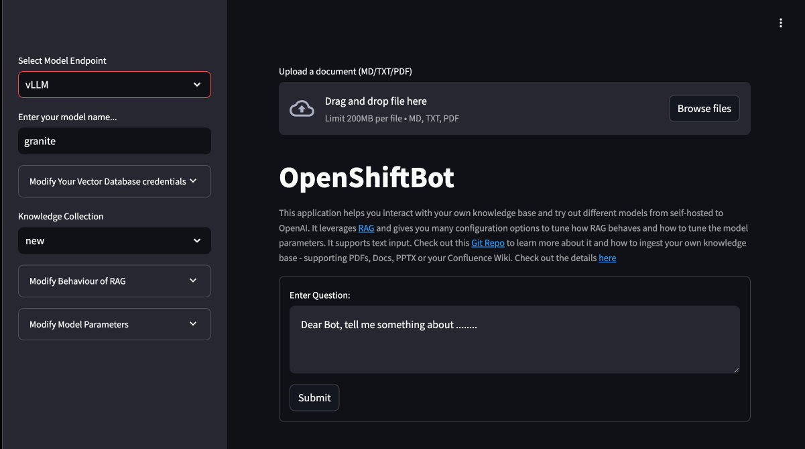

# Introduction

This repository contains examples for Milvus and vLLM n OpenShift AI.

## Important Disclaimer

> IMPORTANT DISCLAIMER: Read before proceed!
> 1. These examples are to showcase the capabilities of OpenShift AI.
> 1. Certain components may not be supported if they are using upstream projects.
> 1. Always check with Red Hat or your account team for supportability. 

## Prerequisite

1. Install OpenShift AI
1. Deploy a Granite model

## Install Milvus

### Creaate a new project
``` bash
oc new-project milvus
```

### Helm install

``` bash
 helm install milvus milvus/milvus \
    --set cluster.enabled=false \
    --set etcd.replicaCount=1 \
    --set minio.mode=standalone \
    --set pulsar.enabled=false \
    --set attu.enabled=true \
    --set securityContext.enabled=false
 ```

### Fix SCC for OpenShift :(
``` bash
kubectl patch statefulset milvus-etcd --type=json -p='[{"op": "remove", "path": "/spec/template/spec/containers/0/securityContext"}]'

kubectl patch statefulset milvus-etcd --type=json -p='[{"op": "remove", "path": "/spec/template/spec/securityContext"}]'
```

You should get all pods running:
``` bash
oc get pods
NAME                                 READY   STATUS    RESTARTS       AGE
milvus-attu-d45fdb4cc-4q9g4          1/1     Running   0              6m24s
milvus-etcd-0                        1/1     Running   0              3m20s
milvus-minio-76f9d647d5-4vw99        1/1     Running   0              6m24s
milvus-standalone-5d5b68d9bb-f952j   1/1     Running   1 (104s ago)   6m24s
````


## Install the app

### Creaate a new project

```bash
oc new-project rag-demo
```

## Build the Streamlit app
``` bash
oc new-app https://github.com/tsailiming/openshift-ai-rag \
    --context-dir=src/streamlit \
    --image-stream=python:3.11-ubi9 \
    --name=streamlit-app \
    -e MILVUS_HOST=my-release-milvus.milvus.svc.cluster.local \
    -e VLLM_ENDPOINT=https://granite-demo.apps.multus-test.sandbox323.opentlc.com/v1
```

Observe the build config logs:
``` bash
oc logs -f buildconfig/streamlit-app
```

If necessary set the environment variables:

``` bash
oc set env deploy/streamlit-app VLLM_ENDPOINT=https://granite-demo.apps.multus-test.sandbox323.opentlc.com/v1
 
oc set env deploy/streamlit-app MILVUS_HOST=milvus.milvus.svc.cluster.local
 ```

Create route:
``` bash
oc create route edge --service=streamlit-app --port 8080-tcp
```

### How to use

Get the route:
``` bash
oc get route streamlit-app -o jsonpath='https://{.spec.host}'
```

Within the app, you should:
1. Select the model endpoint
2. Enter the model name. It should be populated automatically
3. Choose the knowledge database. If there are no Milvus collections, the "new" collection will be created.
4. You can now upload a document to the Milvus collection. 

